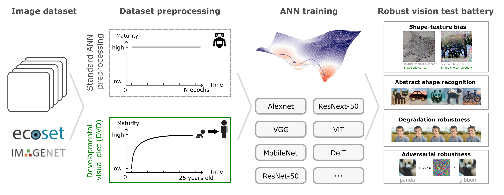
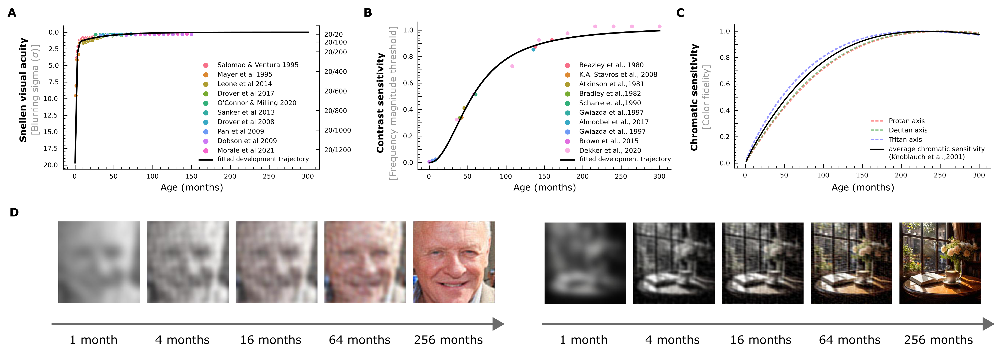

# Adopting a human developmental visual diet (DVD) diet yields robust, shape-based AI vision

A plug-and-play training curriculum that progressively “ages” each image, mimicking the evolving visual sensitivities of the human visual system, from immature newborn vision through to mature adulthood.

---

## 1 Why Developmental Visual Diet (DVD)?

* Human vision begins with severely **immature** inputs, whereas current ANNs mainly train on **instantaneous, high-fidelity** inputs.  
* We model developmental trajectories of **visual acuity**, **contrast sensitivity**, and **chromatic sensitivity** from birth to 25 years.  
* A differentiable pipeline dynamically applies these sensory maturation *on-the-fly* during training.  
* Guiding AI vision through this **Developmental Visual Diet** produces models that better align with hallmark features of human visual robustness:  
  1) Near-human **shape bias**  
  2) Enhanced **robustness to corruptions**  
  3) Improved **resilience to adversarial attacks**  
  4) **Abstract shape recognition** beyond state-of-the-art vision-language models (e.g., ChatGPT-4o, Gemini 2.0 Flash, LLaMA-4-Scout)

### 📈 Developmental visual trajectories  



---

## 2 Installation

```bash
git clone https://github.com/KietzmannLab/DVD.git
cd DVD
pip install -e .
python - <<'PY'
import dvd, torch
print("DVD version:", dvd.__version__, "| CUDA =", torch.cuda.is_available())
PY
```

## 3 Quick demo - aging visual experience

```python
from pathlib import Path
from typing import List
import matplotlib.pyplot as plt
import numpy as np
from PIL import Image
import torch
from dvd.dvd.development import DVDTransformer, DVDConfig # DVD Data Transformer (main API)

# ------------------------------------------------------------
# Configuration
# ------------------------------------------------------------
AGES: List[int] = [1, 4, 16, 64, 256]   # ages in months
IMG_SIZE: int = 256                     # resize target (px)
CFG = DVDConfig() 
# Note: If your input images are not normalized to [0, 1], consider set 'by_percentile=True' in DVDConfig() to percentile-based thresholding, which adapts to the image’s actual intensity distribution.

# Input / output paths
ASSETS_DIR = Path("assets/example_stimuli")
IMAGE_PATHS = [
    ASSETS_DIR / "example_1.jpeg",
    ASSETS_DIR / "example_2.jpeg",
]
OUT_DIR = Path("results/dvd_demo_output")
OUT_PATH = OUT_DIR / "dvd_demo_output_percentile.pdf"

# Helper: load an image as [1, 3, H, W] float tensor in [0, 1]
def load_tensor(fp: Path) -> torch.Tensor:
    img = Image.open(fp).convert("RGB")
    img.thumbnail((IMG_SIZE, IMG_SIZE), Image.LANCZOS)
    arr = np.asarray(img).transpose(2, 0, 1) / 255.0
    return torch.from_numpy(arr).unsqueeze(0).float()

# Main: build demo
def make_demo(paths: List[Path], outfile: Path) -> None:
    dvdt = DVDTransformer(CFG)
    tensors = [load_tensor(p) for p in paths]

    rows, cols = len(tensors), len(AGES)
    fig, ax = plt.subplots(rows, cols, figsize=(3 * cols, 3 * rows))

    for r, img_t in enumerate(tensors):
        for c, age in enumerate(AGES):
            out = dvdt(img_t.clone(), months=age)              # DVD data transformation
            vis = out.squeeze(0).permute(1, 2, 0).numpy().clip(0, 1)
            ax[r, c].imshow(vis)
            ax[r, c].axis("off")
            if r == 0:
                ax[r, c].set_title(f"{age} mo", fontsize=12)

    fig.tight_layout()
    outfile.parent.mkdir(parents=True, exist_ok=True)
    fig.savefig(outfile, dpi=300)
    print(f"Saved {outfile.resolve()}")


make_demo(IMAGE_PATHS, OUT_PATH)
```

## 4 Training with DVD

```bash
python scripts/main.py \
  --dataset-name ecoset --data-root /datasets \
  --arch resnet50 --epochs 300 --batch-size 512 --image-size 256 \
  --lr 1e-4 --lr-scheduler fixed \
  --development_strategy dvd --months_per_epoch 2 --time_order chronological \
  --apply_blur --apply_color --apply_contrast \
  --contrast_amplitude_beta 0.1 --contrast_amplitude_lambda 150
```

| Flag                     | Purpose                                             |
|--------------------------|-----------------------------------------------------|
| `--development_strategy` | `dvd` (full curriculum) or `adult` (control).       |
| `--months_per_epoch`     | Virtual ageing per epoch (smaller = finer).         |
| `--time_order`           | `chronological`, `fully_random`.                    |
| `--apply_*`              | Toggle acuity / colour / contrast sensitivities.    |
| `--contrast_amplitude_*` | Fine-tune frequency amplitude thresholding.         |


## 5 Core API

```python
from dvd.dvd.development import DVDTransformer, DVDConfig, AgeCurve

# Initialize transformer and generate age mapping curve
dvdt = DVDTransformer(DVDConfig())
age_curve = AgeCurve.generate(
    epochs=args.epochs,
    steps_per_epoch=len(train_loader),
    months_per_epoch=args.months_per_epoch,
)

# Map current batch index to virtual age in months
step_idx = (epoch * len(train_loader)) + i
age_months = age_curve[step_idx]

# Apply age-based visual transformations
images_aged = dvdt(img_t.clone(), months=age, curriculum=age_curve)      
```

## 6 Citation

```bash
@article{lu2025dvd,
  title   = {Adopting a human developmental visual diet yields robust, shape-based AI vision models},
  author  = {Zejin Lu, Sushrut Thorat, Radoslaw M Cichy & Tim C Kietzmann},
  journal = {Placeholders – will be filled once DOI is live.)},
  year    = {2025}
} 
```
