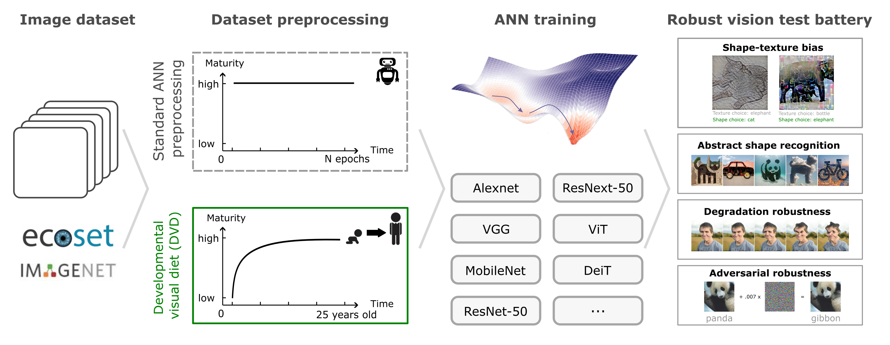
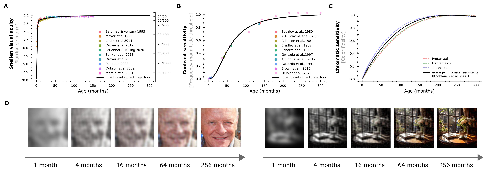

# Scale-Free Developmental Visual Diet (DVD)

[](https://arxiv.org/abs/2507.03168)
[](https://opensource.org/licenses/MIT)



DVD is a **plug-and-play training curriculum** that progressively "ages" input images. By mimicking the maturation of the human visual system, from the blurry, low-contrast world of an infant to the high-fidelity vision of an adult, DVD bridges the gap between biological learning and Artificial Neural Networks (ANNs).

---

## 💡 Why DVD?

Standard ANNs are fed "adult" high-fidelity data from day one. In contrast, human infants learn from a highly constrained sensory diet. DVD models this trajectory through three core lenses:

- **Acuity:** Spatial resolution that sharpens over time.
- **Contrast:** Sensitivity to light/dark differences that expands across frequencies.
- **Color:** Chromatic saturation that gradually matures.

The **Scale-Free** version reformulates these transformations relative to image geometry and Nyquist limits, ensuring consistent behavior across different resolutions and viewing conditions.

### 📈 Developmental Trajectories



---

## 🚀 Quick Start

### Installation

Setup typically takes 1–3 minutes on a standard machine.

```bash
git clone https://github.com/KietzmannLab/DVD.git
cd DVD
pip install -e .
```

### Minimal Usage

```python
import torch
from dvd_scale_free.dvd_scale_free.development import DVDTransformer, DVDConfig

# 1. Initialize
config = DVDConfig(image_size=224)
transformer = DVDTransformer(config)

# 2. Transform (Simulate a 1-month-old infant's vision)
x = torch.rand(1, 3, 224, 224)
y = transformer(x, months=1)

print(f"Output shape: {y.shape}")
```

---

## 🛠️ The Pipeline

DVD applies a three-stage differentiable transformation:

1. **Acuity:** Gaussian or frequency-domain filtering to limit spatial detail.
2. **Contrast:** Frequency-dependent filtering (Barten-style) to control information density.
3. **Color:** Progressive desaturation and restoration of chromatic channels.

### Core Hyperparameters

While highly configurable, the curriculum is primarily governed by two key "knobs":

| Hyperparameter | Description |
| :--- | :--- |
| `months_per_epoch` | Controls the rate of visual maturation over training. |
| `contrast_progress_logspan_start` | Sets the initial mapping from contrast sensitivity to contrast amplitude in the frequency domain. |

---

## 📊 Training Example

Integrate DVD into your training loop by mapping training steps to "virtual months":

```python
from dvd_scale_free.dvd_scale_free.development import DVDTransformer, DVDConfig, generate_age_months_curve

# Setup curve: 150 epochs, 2 virtual months per epoch
age_curve = generate_age_months_curve(
    total_epochs=150,
    len_train_loader=len(train_loader),
    months_per_epoch=2
)

# Inside training loop:
for i, (images, targets) in enumerate(train_loader):
    step_idx = (epoch * len(train_loader)) + i
    current_age = age_curve[step_idx]

    # Age the batch
    images_aged = transformer(images.cuda(), months=current_age)

    # Standard forward/backward pass...
```

---

## 🧪 Experiments & CLI

Run a full training session on **Ecoset** or **ImageNet** using the provided scripts:

```bash
python scripts/main.py /path/to/datasets \
  --arch resnet50 \
  --dataset-name ecoset_square256 \
  --development_strategy dvd \
  --months_per_epoch 2 \
  --contrast_progress_logspan_start 5e-3 \
  --batch-size-per-gpu 512
```

### Key CLI Flags

- `--development_strategy`: Use `dvd` for the curriculum or `adult` for standard training.
- `--time_order`: `chronological` (normal aging) or `randomized` (shuffled ages).
- `--blur_mode`: Choose between `gaussian` or `frequency-domain` acuity.

---

## 📚 Datasets

DVD has been validated on:

- **Ecoset:** A more ecologically valid natural image dataset ([Mehrer et al., 2021](https://www.pnas.org/doi/10.1073/pnas.2011417118)).
- **ImageNet:** The standard benchmark for visual recognition.

---

## ✍️ Citation

If you use DVD in your research, please cite our work:

```bibtex
@article{lu2025dvd,
  title   = {Adopting a human developmental visual diet yields robust, shape-based AI vision},
  author  = {Lu, Zejin and Thorat, Sushrut and Cichy, Radoslaw M. and Kietzmann, Tim C.},
  journal = {arXiv preprint arXiv:2507.03168},
  year    = {2025},
  doi     = {10.48550/arXiv.2507.03168},
  url     = {https://arxiv.org/abs/2507.03168}
}
```